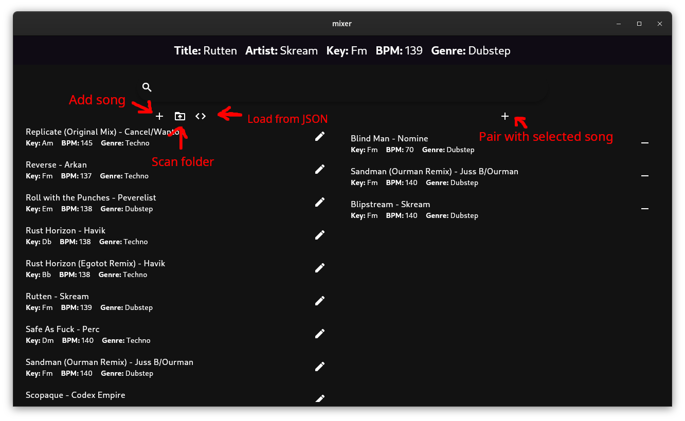
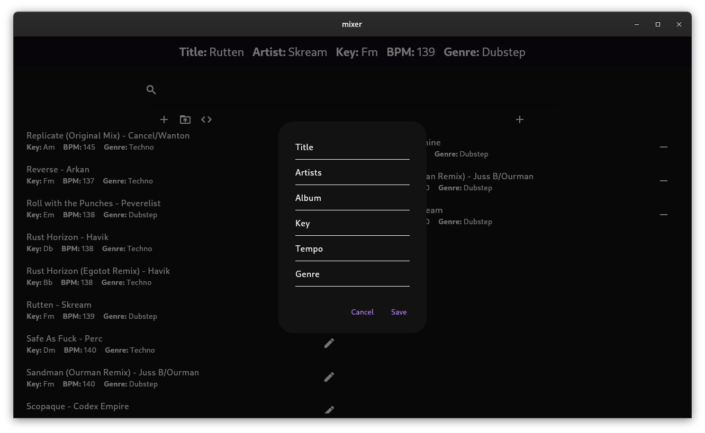
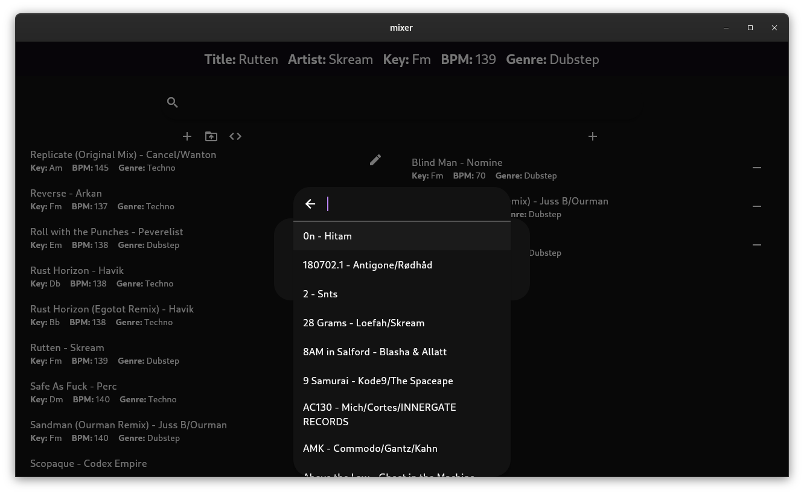

# mixer

A DJ-ing tool to assist (me) in learning and mapping out what songs are good for mixing together.

## How to use

It's pretty simple: add all your songs to the library and then start pairing.

If you want to speed things up a little and avoid adding the songs one-by-one, there is the ability to scan a folder of songs (MP3, WAV, etc.) and import them into the application. However, this has the caveat that the songs do not have BPM, Key, or Genre information (even if it is present in the ID3 metadata; this is a limitation of the file scanner).

Conversely, there is also the ability to import a JSON file with song information. The JSON has to have the following schema:

```json
{
    "tracks": [
        {
            "artists": "Lorem",
            "title": "Ipsum",
            "album": "Dolor",
            "genre": "Sit",
            "tempo": "150",
            "key": "Cm",
            "composer": "Amet"
        },
        {
            "artists": "Lorem2",
            "title": "Ipsum",
            "album": "Dolor",
            "genre": "Sit",
            "tempo": "150",
            "key": "Cm",
            "composer": "Amet"
        },
    ]
}
```

## Application database

The song data is stored into a JSON file. You can view said file at in your "Documents" folder, under "mixxer". By editing this JSON, you are essentially editing the database. The schema of the databse is as follows:

```json
{
    "tracks": {
        "track_key": {
            "artists": "string",
            "title": "string",
            "album": "string",
            "genre": "string",
            "tempo": "string",
            "key": "string",
            "composer": "string"
        }
    },
    "edges": [
        ["track_key1", "track_key2"]
    ]
}
```

## Screenshots






